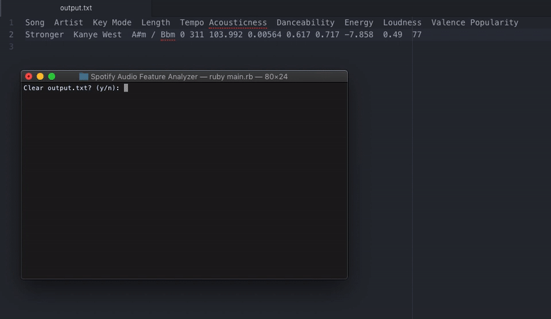

# Spotify Audio Feature Analyzer

A Ruby console program that uses the [RSpotify](https://github.com/guilhermesad/rspotify) wrapper to let users look up songs on Spotify, retrieve the [quantitative audio features of those songs](https://developer.spotify.com/documentation/web-api/reference/tracks/get-audio-features/), and store that data on a .txt for easy formatting to spreadsheet.

I created this program for my AP Research project, which was similar to [this project](https://secure-media.collegeboard.org/digitalServices/pdf/ap/ap17-research-sample-b-high.pdf). I used Ruby for this project rather than some data coding langauge (like Python or R) because Ruby had [RSpotify](https://github.com/guilhermesad/rspotify) which made things soooo much easier for a noob programmer like me. Likewise, I designed this program to be super straightforward to use and modify. Just type in a song or artist, and the program will show you the 20 most relevant results. Pick a song and the program will show you the [audio features of the song](https://developer.spotify.com/documentation/web-api/reference/tracks/get-audio-features/) and write it to a .txt file, which is formatted for easy copypasting to spreadsheet programs.

Demo:

